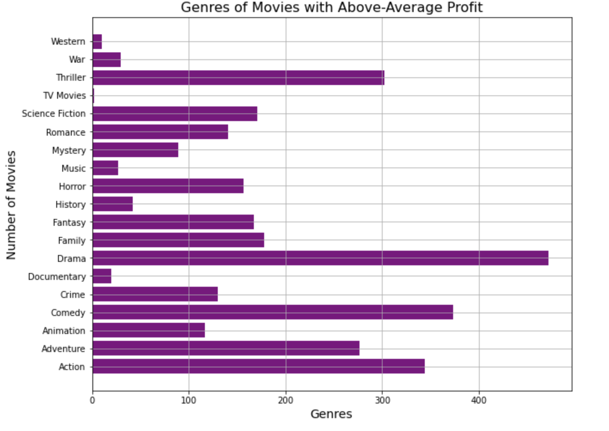

# Overview

     
   Microsoft wants to create their own original video content as part of their new movie studio. In order to do so, they need to know what types of movies are most successful right now and what it is that is making them so successful. Through analyzing data on a wide range of movies from various sources, this project will show which genres of movies have done the best, whether movies are more likely to be known for having a famous actor/actress, writer, or director, and whether higher production budgets are related to higher profits. This information will not only be able to provide Microsoft with valuable advice about the types of movies that they should focus their efforts on, but also how important it is that they set aside a large production budget for a movie, and whether it is more important to hire a well-known actor/actress, writer, or director in order to get their movie the most attention.

# Business Understanding

Microsoft may have better chances of success with their new movie venture by creating movies in the genres that are doing well, allocating an appropriate budget to the project, and hiring a well known director to attract people to watch their movies. 

# Data Understanding

The data is sourced from [This GitHub Repository](https://github.com/learn-co-curriculum/dsc-project-template/tree/template-mvp/zippedData). You can clone this repository down, rename the "zippedData" folder to "Data". Place it in the root directory of this repo.
The measure of success I used for movies in this project is profit (production budget subtracted from worldwide gross). I felt that this would be the best way to show which movies were popular amongst the general public as opposed to just movie critics, as ratings would show.
I utilized data from three sources. The dataset from IMDB in the form of an SQL database contained many different tables, I used the ones called movie_basics, which contained the basic information of all the movies in the database, known_for, which showed the people that each movie was known for by their person_id, and persons, which provided the names and primary professions for each person that a movie was known for. The dataset from TheMovieDB provided information for a large number of movies, including their genre codes. The dataset from The Numbers provided the production budgets and worldwide gross for movies, which I then used to calculate profit.

## Data Preparation

For data representing money (production budget and worldwide gross), I removed the dollar signs and commas within the values and converted them into integers to be able to work with them and perform analyses with them more easily later on. 
I created a profit feature that represents the total worldwide gross value for a movie, minus its initial budget to see how profitable the movie was overall. Then, I dropped any unnecessary columns.
I joined together the dataframes from the TN data and the TMDB data in order to compare movies that were in both datasets to their respective profits to gauge how successful they were.
In order to get the data for the highest profiting movie genres, I first removed any commas or square brackets in the genre ids column to list them separately by using .explode(). A dictionary was created to match each genre id with its corresponding genre name, which then replaced the genre ids in the dataframe by using a for loop.
To determine if it was more common for a movie to be known for an actor/actress, a writer, or a director, I limited the data to only include people known for that were of those four primary professions.
After the duplicate columns were removed from the data and the columns were named more appropriately, three new dataframes were created to show the number of people for each primary profession that movies were known for, to be compared later.

# Exploratory Data analysis

Of the movies in the IMDB database that were known for either an actor/actress, writer, or director, they were most often known for a director, and least often known for an actor or actress.

For the movies in the TN database, the majority of movies still had a low budget (less than 100,000,000 dollars) and a low profit (less than 500,000,000 dollars). However, the ones that had a higher budget did also earn higher profits on average.

Out of all of the movies that were in both the TN and TMDB databases, the top five movie genres that received the highest profits were action, adventure, comedy, drama, and fantasy.

# Conclusion & Recommendations

Based on the analysis of the data examined in this project, in order to have the best chances of success in their new movie endeavor, Microsoft should:
- Focus on creating movies that are in the action, adventure, comedy, drama, and fantasy genres (or a combination)
- Allocate an appropriate production budget to their movies, ideally greater than 50,000,000 dollars
- Focus some of the budget on hiring a well-known director to attract more attention to the movie

## Limitations

- The table in the IMDB database for the person that movies were known for contained individuals of many different primary professions. 
- There are many factors that go into whether or not a movie is successful. In addition to the ones investigated in this project, there is how long the movie ran for, how many countries it was shown in, and many more. While the results of this analysis did show a relationship between both a higher production budget and certain genres with a higher profit, this does not mean that the higher profit was caused by either of those things. 
- These analyses did not limit the datasets in terms of time. Some of these movies date back to 2010, etc. Data that was on movies only from more recent years may provide a better idea of the current trends.

## Next Steps 
There are many more aspects that could be explored in order to provide additional insights to Microsoft for how they can make their new movie studio as successful as possible.
- Compare these same factors across the different datasets (i.e. do the movies in IMDB have the same most profitable genres at the ones in the other datasets?
- Explore the other features of the data, such as how long the movies showed for in theatres, the region(s) they were released in, and more.
- The data used for this project is from a many-year time span. To show more current trends specifically, further analysis could compare same factors for only recent years (i.e. the last 5 years) to see if the trends change any in recent years.